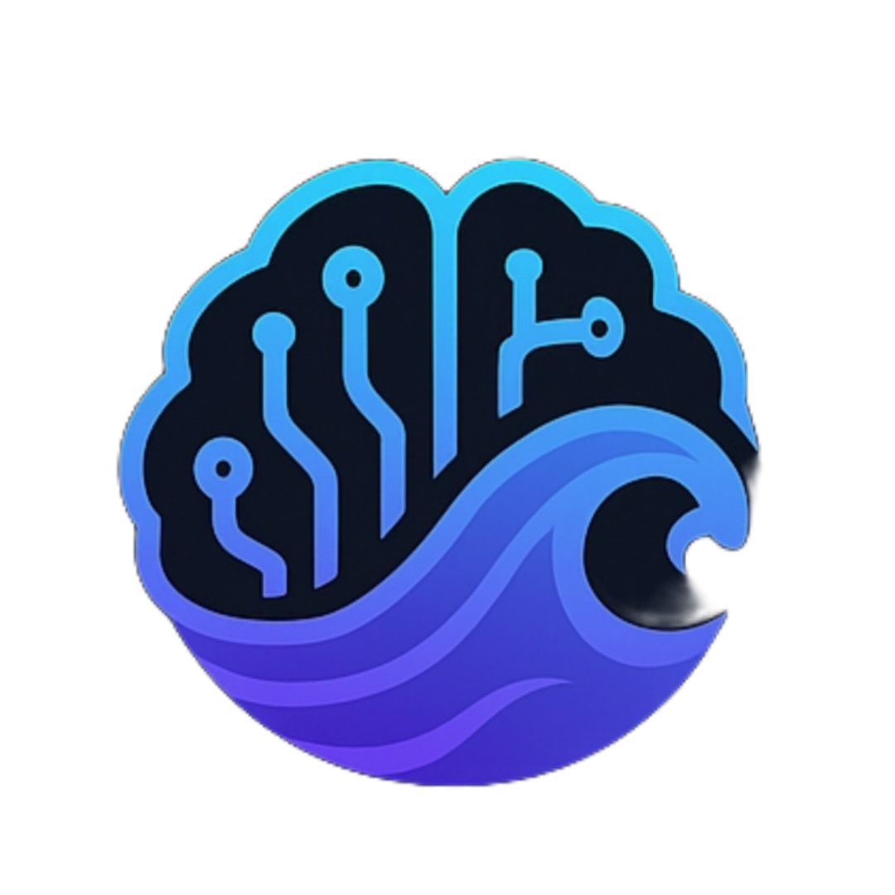

# MindSurf: AI-Powered Learning Platform

<p align="center">
  
</p>

MindSurf is an adaptive learning platform that leverages AI to personalize education and enhance understanding of complex topics. By combining modern technologies on both frontend and backend, MindSurf delivers a seamless, engaging learning experience tailored to each student's unique needs.

## 🚀 Features

- **AI Study Companion**: Personalized learning assistant powered by advanced AI
- **Smart Content Analysis**: Upload textbooks or YouTube videos for instant simplified explanations
- **Interactive Quizzes**: Adaptive assessments that provide instant feedback
- **Progress Tracking**: Visual insights into your learning journey with personalized recommendations
- **Voice Assistant**: Natural voice interaction using VAPI for a hands-free learning experience

## AI agent wokflow diagram and RAG Diagram and Architecture Diagram

<div align="center">
  <div style="display: flex; align-items: center; justify-content: center; gap: 20px; margin-bottom: 20px;">
    
    
  </div>
</div>
<div align="center" style="margin-bottom: 20px;">
  
</div>

## 🛠️ Technology Stack

<h2 align="center">🖥️ Frontend Stack</h2>
<p align="center">
  
  
  
  
  
  
</p>

<h2 align="center">🛠️ Backend Stack</h2>
<p align="center">
  
  
  
</p>

<h2 align="center">☁️ Cloud & Database & Payment</h2>
<p align="center">
  <a href="https://firebase.google.com/"></a>
  
  <a href="https://stripe.com/"></a>
</p>

<h2 align="center">🧠 AI & LLMs</h2>
<p align="center">
  
  
  
</p>


- **Next.js** + **FastAPI**: Modern full-stack development with React and Python
- **TailwindCSS** + **Framer Motion**: Beautiful, responsive UI with fluid animations
- **Radix UI** + **Shadcn**: Accessible, reusable component system
- **Google AI (Gemini)** + **LangChain**: Advanced AI capabilities for learning
- **ChromaDB**: Vector database for semantic search and content retrieval
- **RAG Architecture**: Ensuring accurate, context-aware AI responses
- **TypeScript** + **Zod**: Type-safe development and validation
- **Lucide React**: Beautiful and consistent iconography

## ✨ Key Features Explained

### Personalized Learning
Our AI analyzes your learning style and customizes content delivery to match your unique needs:
- Smart content simplification
- Personalized explanations
- Adaptive learning paths
- Concept revisitation for difficult topics

### Simplified Explanations
Upload any complex material and our AI breaks it down into easily digestible concepts:
- Text content analysis
- Video lecture simplification
- Step-by-step breakdowns
- Student-friendly language

### AI Study Buddy
A conversational assistant that answers questions and helps you work through difficult concepts:
- Text and voice interaction
- Step-by-step explanations
- 24/7 learning support
- Conceptual clarifications

### Smart Quiz Builder
Automatically generated quizzes tailored to your learning goals and current knowledge level:
- Custom difficulty levels
- Instant feedback
- Targeted resource suggestions
- Comprehensive review materials

## 🔧 Technical Implementation

### RAG Implementation
MindSurf implements Retrieval Augmented Generation (RAG) to ensure that AI-generated content is accurate and contextually relevant:

1. User content (textbooks, videos, etc.) is processed and split into manageable chunks
2. These chunks are embedded using Google's embedding models
3. Embeddings are stored in ChromaDB for efficient retrieval
4. When a user asks a question, the system retrieves the most relevant content from the vector database
5. Google's Gemini model generates a response grounded in the retrieved content

### Voice Assistant Integration
The platform features a voice assistant powered by VAPI:
- Natural language voice commands
- Voice-to-text for hands-free learning
- Text-to-speech for content consumption
- Customizable voice preferences

## 🏗️ Project Structure

```
Janabs-HackSpire2025/
├── backend/               # FastAPI backend
│   ├── .env               # Environment variables
│   ├── main.py            # Main application file
│   ├── requirements.txt   # Python dependencies
│   └── Procfile           # Deployment configuration
│
├── frontend/              # Next.js frontend
│   ├── app/               # Next.js app directory
│   │   ├── ai/            # AI integration components
│   │   ├── ai-companion/  # AI study buddy feature
│   │   ├── components/    # Shared UI components
│   │   ├── content-analysis/ # Document analysis feature
│   │   ├── quizzes/       # Interactive quiz feature
│   │   └── progress/      # Learning progress tracking
│   │
│   ├── lib/               # Utility functions
│   ├── public/            # Static assets
│   └── next.config.ts     # Next.js configuration
```

## 👨‍💻 Development Team

- Dhruv Mali
- Siddhant Sankesara
- Dev Kadakia
- Dhwanish Desai 

## 📋 Getting Started

### Prerequisites

- Node.js 18.x or later
- Python 3.10 or later
- Google AI API key for Gemini models

### Backend Setup

1. Navigate to the backend directory:
   ```bash
   cd backend
   ```

2. Create a virtual environment:
   ```bash
   python -m venv venv
   source venv/bin/activate  # On Windows: venv\Scripts\activate
   ```

3. Install dependencies:
   ```bash
   pip install -r requirements.txt
   ```

4. Create a `.env` file with your API keys:
   ```
   GOOGLE_API_KEY=your_google_api_key
   ALLOWED_ORIGINS=http://localhost:3000
   ```

5. Start the server:
   ```bash
   uvicorn main:app --reload
   ```

### Frontend Setup

1. Navigate to the frontend directory:
   ```bash
   cd frontend
   ```

2. Install dependencies:
   ```bash
   npm install
   ```

3. Create a `.env` file:
   ```
   NEXT_PUBLIC_API_URL=http://localhost:8000
   ```

4. Start the development server:
   ```bash
   npm run dev
   ```

5. Open [http://localhost:3000](http://localhost:3000) in your browser

## 🌐 Live Demo

Check out the live demo: [MindSurf Demo](https://mindsurf.vercel.app)

## 📝 License

This project is part of the HackSpire 2025 hackathon.

---

Developed with ❤️ by Team Janabs for HackSpire 2025
